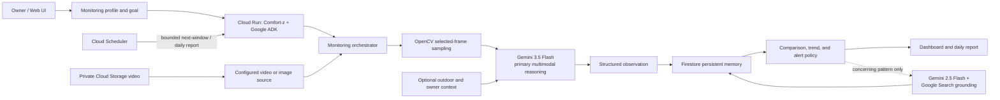

# Comfort-z

Comfort-z is a persistent, non-diagnostic agentic animal-monitoring system built for Google's **All Things Agentic Hackathon**. An owner creates a monitoring goal and profile; Comfort-z performs bounded visual observations, interprets selected frames with Gemini, stores structured evidence, compares meaningful history, applies an explainable alert policy, and can continue monitoring or produce a daily report.

It does not diagnose disease or replace veterinary care. Its role is to describe observed behaviour and context, surface patterns worth attention, and recommend professional advice where appropriate.

## Agentic workflow



Video playback in the dashboard is reference playback only. Gemini sampling is bounded and independent of playback timing; Comfort-z does not analyze every video frame.

## Technology

- **Gemini 3.5 Flash**: primary multimodal monitoring and reasoning model.
- **Gemini 2.5 Flash**: optional, bounded Google Search-grounded research helper only.
- **Google ADK**: agent and monitoring-tool orchestration.
- **Cloud Run**: private HTTP runtime for the deployed hackathon service.
- **Firestore**: persistent profiles, observations, owner updates, reports, and monitoring state.
- **Google Cloud Storage**: private configured demo-video source where applicable.
- **Secret Manager**: Gemini Developer API key in Cloud Run.
- **Cloud Scheduler**: bounded recurring monitoring and reporting invocations.
- **OpenCV**: local/video frame capture and sampling.
- **Open-Meteo**: optional outdoor weather context.
- **Vanilla HTML/CSS/JavaScript**: web dashboard.

The runtime does not use OpenAI models or APIs. The deployed hackathon version uses the Gemini Developer API and API-key secret, not Vertex AI.

## Local setup

Prerequisites: Python 3.11+ and a Gemini Developer API key from Google AI Studio.

```powershell
py -3.11 -m venv .venv
.\.venv\Scripts\Activate.ps1
pip install -r requirements-dev.txt
Copy-Item .env.example .env
```

Set `GEMINI_API_KEY` or `GOOGLE_API_KEY` in `.env`; never commit either value. Then run:

```powershell
pytest -q
adk web --host 127.0.0.1 --port 8000 .
python -c "from comfort_z.agent import root_agent; print(root_agent.name)"
```

The import check should print `comfort_z` without contacting Gemini. Vertex AI compatibility may remain available for local experimentation with Application Default Credentials and `GOOGLE_GENAI_USE_VERTEXAI=true`, but that is not the deployed hackathon configuration.

## Configuration

```dotenv
# Primary Comfort-z monitoring model
GEMINI_MODEL=gemini-3.5-flash

# Optional conditional research only
RESEARCH_PROVIDER=google_search
RESEARCH_MODEL=gemini-2.5-flash

# Persistence
OBSERVATION_STORE=firestore
GOOGLE_CLOUD_PROJECT=YOUR_PROJECT_ID
FIRESTORE_OBSERVATIONS_COLLECTION=observations

# Gemini Developer API key: set one, never both in source control
GOOGLE_API_KEY=
# GEMINI_API_KEY=
```

`GEMINI_MODEL` remains the primary monitoring model. The Google Search research provider chooses its model in this order: an explicit provider model, `RESEARCH_MODEL`, then `gemini-2.5-flash`. It never falls back to `GEMINI_MODEL`.

## Monitoring profiles and bounded video monitoring

An owner profile records the animal, monitoring goal, optional expected species and enclosure/location context, connected source, sampling settings, daily sample budget, cursor, active state, and report schedule. A profile may exist before a source is connected; source-less profiles are stored honestly and monitoring exits without opening a camera, video, Gemini, or research provider.

Each `next-window` call is finite. It reads the saved profile/cursor, analyzes only a small requested number of selected frames (never more than the remaining daily budget), persists results, and advances the cursor for the next invocation. Pre-recorded video therefore simulates continued monitoring without requiring a permanently open HTTP request. Transient Gemini 429/503 failures have bounded retries and cannot bypass the requested sample limit.

OpenCV supports local video files and local webcams. A webcam needs access to the machine/device running Comfort-z; it is not a cloud camera-ingestion mechanism. A configured private `gs://bucket/object` video can be downloaded through Application Default Credentials to a temporary file for bounded OpenCV processing. The original `gs://` reference remains the persisted source metadata, and the temporary file is removed after processing.

For private Cloud Storage sources, grant the Cloud Run runtime service account bucket-scoped `roles/storage.objectViewer` (or equivalent `storage.objects.get`). Comfort-z neither makes the bucket public nor creates signed URLs.

## Monitoring source preview

`GET /animals/{animal_id}/monitoring-source-preview` returns a read-only preview of that profile's configured **video** source.

- It is profile-derived only; arbitrary local filesystem paths are never exposed.
- It supports private `gs://` objects through the Cloud Run runtime credentials.
- It supports browser byte ranges for video playback.
- It does not start monitoring, sample Gemini, create observations, change budgets/cursors, or mutate monitoring state.
- It does not create a public URL or signed URL.

The preview is a visual reference, not a synchronized representation of Gemini's sampled frames.

## Owner context and environment

Owners can persist typed or voice-confirmed care updates such as feeding, care events, appetite/behaviour notes, availability, and direct measurements. A direct reading (for example, aquarium water temperature) is owner-reported historical context, not sensor telemetry and not a Gemini observation. It can inform a later interpretation, but cannot independently create a visual trend or alert.

Outdoor Open-Meteo context is optional and separate from enclosure readings. It is requested only when a profile has the required coordinates. Comfort-z explicitly treats outdoor weather as context only: it must not assume that outdoor temperature equals aquarium, terrarium, room, cage, or other enclosure conditions. Location can be updated by the owner; the system does not automatically infer GPS, IP, or camera location.

## Conditional grounded research

Research is optional and disabled by default. It is considered only after a valid observation shows a worsening, recurring, alerting, or explicitly unresolved non-normal pattern. It is not run for normal, non-visible, uncertain, or isolated mild observations.

Set `RESEARCH_PROVIDER=google_search` to enable the Google Search grounding provider. The provider uses the existing Gemini Developer API-key selection (`GOOGLE_API_KEY` or `GEMINI_API_KEY`) and the separate research-model precedence described above. It saves at most five concise citation-backed summaries, never raw web pages or full grounded responses. If search grounding is unavailable, quota-limited, empty, or uncited, monitoring and its existing alert decision continue unchanged. Matching successful research is reused for 24 hours.

Google Search grounding is implemented and configurable, but successful live grounding was unavailable under the current quota/access during validation; it is not claimed as a demonstrated deployed result.

## Storage

Local development defaults to JSON state under ignored `data/` paths. With `OBSERVATION_STORE=firestore`, Comfort-z uses Application Default Credentials and persists data by animal, including:

- observations: `animals/{animal_id}/observations/{observation_id}`
- profile: `animals/{animal_id}/monitoring/profile`
- owner updates: `animals/{animal_id}/owner_updates/{owner_update_id}`
- reports: `animals/{animal_id}/reports/{report_id}`

To enable Firestore locally, create a Firestore Native database, authenticate with Application Default Credentials, and set the store/project variables:

```powershell
gcloud config set project YOUR_PROJECT_ID
gcloud auth application-default login
```

```dotenv
OBSERVATION_STORE=firestore
GOOGLE_CLOUD_PROJECT=YOUR_PROJECT_ID
FIRESTORE_OBSERVATIONS_COLLECTION=observations
```

If the configured Firestore store cannot initialize or respond, Comfort-z returns a useful storage error; it does not silently change stores.

## HTTP API

Key endpoints exposed by the Cloud Run service include:

- `GET /health` - process health, primary model, ADK agent, and selected store; no external call.
- `GET /animals` - persisted profiles for the dashboard.
- `POST /monitoring/profiles`, `GET /monitoring/{animal_id}/profile` - profile persistence and retrieval.
- `POST /monitoring/{animal_id}/start`, `POST /monitoring/{animal_id}/pause` - owner-controlled active state.
- `POST /monitoring/{animal_id}/next-window` - one bounded monitoring operation.
- `POST /monitoring/{animal_id}/daily-report`, `GET /animals/{animal_id}/reports` - persisted reports.
- `GET /animals/{animal_id}/observations` - structured visual history.
- `POST /animals/{animal_id}/owner-updates`, `GET /animals/{animal_id}/owner-updates` - owner-provided care context.
- `POST /animals/{animal_id}/owner-update-drafts/voice` - short voice transcription/normalization draft; it does not persist an update until confirmed.
- `PUT /monitoring/{animal_id}/location` - owner-provided location and optional coordinates.
- `GET /environment/current` - read-only optional outdoor context for supplied coordinates.
- `POST /animals/{animal_id}/profile-photo`, `POST /monitoring/{animal_id}/video-source` - bounded local/demo media upload routes.
- `GET /animals/{animal_id}/monitoring-source-preview` - read-only configured-video preview.

The direct `/monitor` route remains available for an explicit one-off ADK monitoring invocation. Owner uploads are intentionally local/demo storage today: they are not durable across Cloud Run instance replacement until backed by durable private storage.

## Cloud Run and Scheduler

The deployed hackathon service runs on private/authenticated Cloud Run. The container listens on `0.0.0.0:$PORT`; its runtime service account uses Application Default Credentials for Firestore and private Cloud Storage. Store the Gemini Developer API key in Secret Manager and grant the runtime service account only the required Firestore, Secret Manager, and bucket-read permissions. Do not ship `.env`, service-account JSON, local data, or demo videos in the image.

The deployed project has bounded Cloud Scheduler jobs configured to call:

- monitoring next-window every 5 minutes
- daily report at 08:00 `Asia/Kuching`

These jobs may be intentionally paused for quota-controlled demo operation. Scheduler invokes finite HTTP operations; Comfort-z does not rely on a continuously running Cloud Run request or process.

## Demo flow and limitations

The hackathon demo uses a persistent Raku monitoring profile and pre-recorded animal footage as controlled input. A private Cloud Storage source is processed by Cloud Run in bounded windows; Gemini 3.5 Flash interprets selected frames; Firestore history is retrieved and compared; and a persistent concerning pattern can produce an explainable application alert. Owner-provided direct readings and optional outdoor context can inform interpretation. The dashboard shows stored observations and a reference-video preview, while daily reports summarize the saved structured history.

Limitations:

- Pre-recorded demo footage is not claimed as a live camera feed.
- Dashboard playback and Gemini frame sampling are independent and not synchronized.
- Local webcam monitoring requires access to the local machine and device.
- Alerts are surfaced by the application; push/email notification delivery is not implemented.
- Animal-care output is non-diagnostic.
- Optional grounded research may be unavailable because of provider access or quota.
- Local uploaded media is not durable after Cloud Run instance replacement unless it is backed by durable private storage.
