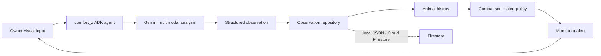

# Comfort-z

Comfort-z is an agentic animal-monitoring MVP for Google's **All Things Agentic Hackathon**. It turns a visual observation into a structured, non-diagnostic record, remembers it, compares it with the animal's history, then decides whether to continue monitoring or create an alert.

> Comfort-z is not veterinary care. It only describes visible behaviour and recommends professional veterinary advice when a pattern is potentially concerning.

## Agentic workflow

The `comfort_z` Google ADK agent owns one goal: **monitor this animal over time**. Its `monitor_animal` tool uses Gemini to interpret an image, saves the result, retrieves the same animal's recent history, compares the records, applies an explainable policy, and returns supporting evidence.



This is deliberately not `prompt → Gemini → answer`: the tool operates on persistent history and independently decides to record, monitor, or alert. It reports the evidence behind each decision.

## Technology

- **Gemini** (`gemini-2.5-flash`): multimodal, structured visual observations.
- **Google ADK**: the `comfort_z` agent and tool orchestration.
- **Firestore**: optional Cloud-ready observation history; local development defaults to JSON.
- **Cloud Run**: deployment-ready Dockerfile.

The runtime does not use OpenAI APIs or models.

## Structure

```text
comfort_z/
  agent.py                 # ADK agent named comfort_z
  models.py                # Observation / decision schemas
  services/                # Gemini, repositories, comparison policy
  tools/monitoring.py      # Agent-callable workflow tools
tests/                      # Storage and policy tests
```

## Local setup

Prerequisites: Python 3.11+ and a Gemini API key from Google AI Studio. For Vertex AI instead, use Application Default Credentials and set `GOOGLE_GENAI_USE_VERTEXAI=true`.

```powershell
py -3.11 -m venv .venv
.\.venv\Scripts\Activate.ps1
pip install -r requirements.txt
Copy-Item .env.example .env
```

Set `GEMINI_API_KEY` in `.env` (never commit it), then run:

```powershell
pytest -q
adk web --host 127.0.0.1 --port 8000 .
python -c "from comfort_z.agent import root_agent; print(root_agent.name)"
```

The final command should print `comfort_z` without calling Gemini. In ADK Web, select `comfort_z` and submit a request such as:

```text
Monitor animal_id "milo" using image_path "C:\\demo\\milo_today.jpg". Save it and explain whether I should monitor or act.
```

## Storage and alerts

Default storage is `data/observations.json`. Set `OBSERVATION_STORE=firestore` plus `GOOGLE_CLOUD_PROJECT` to use Firestore; ensure the credentials/service account can access it. The policy is intentionally simple: a first uncertain/concerning observation is saved for follow-up, while a visible worsening or at least two concerning results among the newest three observations creates an alert. It never makes medical diagnoses.

## Cloud Run

Create a project, enable Cloud Run and Firestore, authenticate, then deploy:

```powershell
gcloud auth application-default login
gcloud run deploy comfort-z --source . --region YOUR_REGION --project YOUR_PROJECT --set-env-vars OBSERVATION_STORE=firestore,GOOGLE_CLOUD_PROJECT=YOUR_PROJECT,GEMINI_MODEL=gemini-2.5-flash
```

For Gemini Developer API, configure `GEMINI_API_KEY` with Cloud Run Secret Manager. For a Google Cloud production setup, prefer a Cloud Run service identity with Vertex AI and Firestore permissions and set `GOOGLE_GENAI_USE_VERTEXAI=true`.

## Demo flow and limitations

Submit an image for Milo to establish a baseline; submit a second image with the same potential issue to demonstrate retrieved history and a persistence alert; submit an improved image to show the trend change. The MVP accepts image files (or any simple Gemini-supported visual MIME type accessible by the server). It does not diagnose disease, provide multi-instance local persistence, or yet ingest full videos/scheduled rechecks—those are natural next steps.
