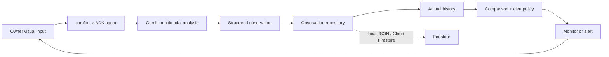

# Comfort-z

Comfort-z is an agentic animal-monitoring MVP for Google's **All Things Agentic Hackathon**. It turns a visual observation into a structured, non-diagnostic record, remembers it, compares it with the animal's history, then decides whether to continue monitoring or create an alert.

> Comfort-z is not veterinary care. It only describes visible behaviour and recommends professional veterinary advice when a pattern is potentially concerning.

## Agentic workflow

The `comfort_z` Google ADK agent owns one goal: **monitor this animal over time**. Its `monitor_animal` tool uses Gemini to interpret an image, saves the result, retrieves the same animal's recent history, compares the records, applies an explainable policy, and returns supporting evidence.



This is deliberately not `prompt → Gemini → answer`: the tool operates on persistent history and independently decides to record, monitor, or alert. It reports the evidence behind each decision.

## Technology

- **Gemini** (`gemini-3.5-flash`): multimodal, structured visual observations.
- **Google ADK**: the `comfort_z` agent and tool orchestration.
- **Firestore**: optional Cloud-ready observation history; local development defaults to JSON.
- **Cloud Run**: deployment-ready Dockerfile.

The runtime does not use OpenAI APIs or models.

## Structure

```text
comfort_z/
  agent.py                 # ADK agent named comfort_z
  models.py                # Observation / decision schemas
  services/                # Gemini, repositories, comparison policy
  tools/monitoring.py      # Agent-callable workflow tools
tests/                      # Storage and policy tests
```

## Local setup

Prerequisites: Python 3.11+ and a Gemini API key from Google AI Studio. For Vertex AI instead, use Application Default Credentials and set `GOOGLE_GENAI_USE_VERTEXAI=true`.

```powershell
py -3.11 -m venv .venv
.\.venv\Scripts\Activate.ps1
pip install -r requirements-dev.txt
Copy-Item .env.example .env
```

Set either `GEMINI_API_KEY` or `GOOGLE_API_KEY` in `.env` (never commit it), then run:

```powershell
pytest -q
adk web --host 127.0.0.1 --port 8000 .
python -c "from comfort_z.agent import root_agent; print(root_agent.name)"
```

The final command should print `comfort_z` without calling Gemini. In ADK Web, select `comfort_z` and submit a request such as:

```text
Monitor animal_id "milo" using image_path "C:\\demo\\milo_today.jpg". Save it and explain whether I should monitor or act.
```

## Basic video monitoring

OpenCV samples a local video or webcam at a deliberate interval; it does not send every frame to Gemini. Each sample is saved through the existing `monitor_animal` workflow, including a source/frame description in the observation record.

Test a local video (five samples, one every five seconds of video time):

```powershell
python -c "from comfort_z.services.video import VideoMonitoringService; result = VideoMonitoringService().monitor('raku', r'C:\\demo\\raku.mp4', sample_interval_seconds=5, max_samples=5, animal_name='Raku', expected_species='Betta splendens'); print(result.model_dump_json(indent=2))"
```

Test webcam device 0 (five samples, one every five seconds of live time):

```powershell
python -c "from comfort_z.services.video import VideoMonitoringService; result = VideoMonitoringService().monitor('raku', 0, sample_interval_seconds=5, max_samples=5, animal_name='Raku', expected_species='Betta splendens'); print(result.model_dump_json(indent=2))"
```

`max_samples` provides a normal bounded stop and limits total sampled-frame attempts, including failed Gemini analyses. Transient Gemini 429/503 responses retry only once by default, use a server retry delay when supplied (otherwise exponential backoff), and stop the session after retries are exhausted. You can tune `max_transient_retries`, `base_retry_delay_seconds`, and `stop_retry_delay_seconds` when calling `monitor`; conservative defaults protect the hackathon/free-tier quota. Code that runs a longer session can retain the service object and call `service.stop()`; an unavailable device, unreadable frame, encoding failure, or one Gemini failure is recorded in `failures` without crashing the session.

When `expected_species` is supplied, Gemini decides whether that expected animal is sufficiently visible instead of freely identifying another creature. Frames marked `animal_not_visible` or `uncertain` are stored for provenance but excluded from behavioural trends and alert persistence.

## Storage and alerts

Default storage is `data/observations.json`. Firestore is used only when `OBSERVATION_STORE=firestore` and `GOOGLE_CLOUD_PROJECT` are set. It uses Application Default Credentials and stores records at `animals/{animal_id}/observations/{observation_id}`: the parent stores stable animal metadata and every observation document retains the existing structured observation payload. `FIRESTORE_OBSERVATIONS_COLLECTION` defaults to `observations`; leave `OBSERVATION_STORE=local` for the validated local fallback. The policy is intentionally simple: a first uncertain/concerning observation is saved for follow-up, while a visible worsening or at least two concerning results among the newest three observations creates an alert. It never makes medical diagnoses.

### Enable Firestore locally

1. Create or select a Google Cloud project, then enable the Firestore API and create a Firestore database in Native mode.
2. Install and initialize the Google Cloud CLI, set the active project, and create Application Default Credentials:

   ```powershell
   gcloud config set project YOUR_PROJECT_ID
   gcloud auth application-default login
   ```

3. In `.env`, set `OBSERVATION_STORE=firestore` and `GOOGLE_CLOUD_PROJECT=YOUR_PROJECT_ID`. Optionally set `FIRESTORE_OBSERVATIONS_COLLECTION=observations`.
4. Run the normal Comfort-z command. If Firestore cannot initialize or respond, Comfort-z reports a storage error with credential/network guidance; it never silently changes the configured store.

## Cloud Run deployment preparation

The container starts the minimal HTTP API with Uvicorn at `0.0.0.0:$PORT`. It provides:

- `GET /health` — process health, selected store, ADK agent, and model; no external request.
- `POST /monitor` — calls the existing `monitor_animal` ADK tool with `animal_id`, `image_path`, and optional animal metadata.
- `GET /animals/{animal_id}/observations?limit=5` — calls the existing repository-backed history tool.

Before deploying, create a Firestore Native database, enable Cloud Run, Cloud Build, Artifact Registry, Firestore, and Secret Manager APIs, then create a dedicated Cloud Run service account. Grant it `roles/datastore.user` for Firestore and `roles/secretmanager.secretAccessor` for the Gemini API-key secret. Cloud Run uses this service account as Application Default Credentials for Firestore; do not upload service-account JSON files.

Create a Secret Manager secret named `comfort-z-gemini-api-key` containing only your Gemini Developer API key. Then deploy from the repository root:

```powershell
gcloud run deploy comfort-z --source . --region YOUR_REGION --project YOUR_PROJECT_ID --service-account comfort-z-runner@YOUR_PROJECT_ID.iam.gserviceaccount.com --set-env-vars OBSERVATION_STORE=firestore,GOOGLE_CLOUD_PROJECT=YOUR_PROJECT_ID,FIRESTORE_OBSERVATIONS_COLLECTION=observations,GEMINI_MODEL=gemini-3.5-flash --set-secrets GOOGLE_API_KEY=comfort-z-gemini-api-key:latest
```

The container image excludes `.env`, virtual environments, local JSON data, ADC files, service-account/credential JSON files, tests, and demo videos. Use `GET /health` after deployment to confirm startup. For a Vertex AI configuration instead of a Gemini API-key secret, set `GOOGLE_GENAI_USE_VERTEXAI=true` and grant the service account the appropriate Vertex AI role.

## Demo flow and limitations

Submit an image for Milo to establish a baseline; submit a second image with the same potential issue to demonstrate retrieved history and a persistence alert; submit an improved image to show the trend change. The MVP accepts image files (or any simple Gemini-supported visual MIME type accessible by the server). It does not diagnose disease, provide multi-instance local persistence, or yet ingest full videos/scheduled rechecks—those are natural next steps.
